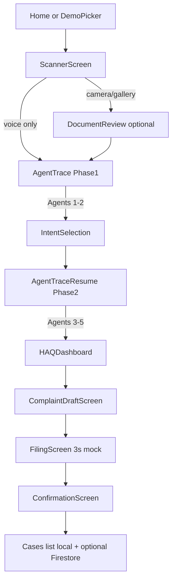
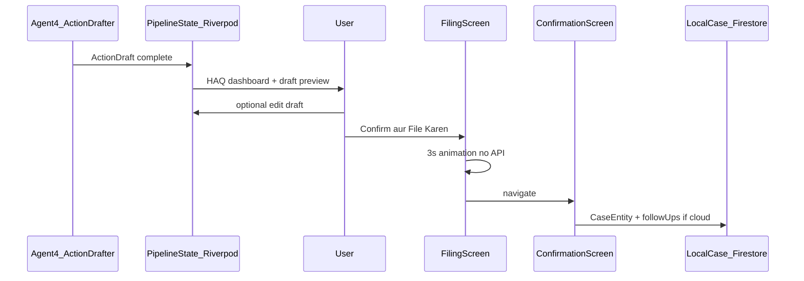
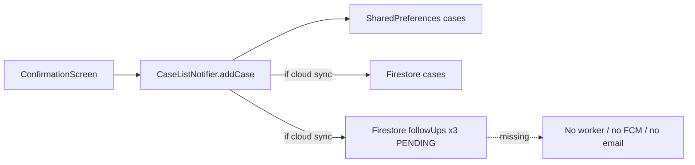

# Complaint Filing Workflow — Technical & Functional Breakdown

This document reflects **current implementation** in the Flutter app, not aspirational copy in [`agents.md`](../agents.md) or [`DarkhwastAI_Documentation.html`](DarkhwastAI_Documentation.html). Where those docs claim autonomous follow-up or group petition filing, the code is narrower.

---

## End-to-end sequence (document upload → “submission”)

| Step | Route | What happens |
|------|-------|----------------|
| Capture | `/scanner` | Photo/gallery → OCR (`OCRService` + ML Kit) or voice text; demo uses `DemoScenarioCatalog` |
| Review | `/document-review` | Optional crop; then `push('/agent-trace')` with `file` + `voiceText` |
| Phase 1 | `/agent-trace` | **Agent 1** document intelligence, **Agent 2** urgency/deadlines → `PipelineStatus.awaitingIntent` |
| Intent | `/intent-selection` | User picks action (complaint, appeal, explain, etc.) → `resumeWithIntent()` |
| Phase 2 | `/agent-trace-resume` | **Agent 3** rights/HAQ, **Agent 4** draft, **Agent 5** collective cluster |
| Results | `/haq-dashboard` | HAQ score, authority, collective banner; CTA to draft |
| Draft review | `/complaint` | Bilingual tabs (Urdu/English), optional edit |
| “Submit” | `/filing` | **3-second animation only** — no HTTP/API |
| Persist | `/confirmation` | Random ref `DW-2026-ISB-####`, `CaseEntity` saved, follow-up docs queued if cloud |

**Routes:** `lib/core/router/app_router.dart`  
**Orchestration:** `lib/features/agent_trace/providers/agent_pipeline_provider.dart`

**AI mode:** `_useMocks = isDemo || !AppEnv.liveAiReady`. Demo/curated uses `MockResponseService` + JSON under `assets/mock_responses/`; live uses `GeminiService` + on-device OCR.

---

## 1. Action Drafter → filing/submission transition

### Where Action Drafter runs

Agent 4 runs **inside Phase 2** of the pipeline, **after** intent selection and **before** the user ever sees the draft screen:

- Mock path: `MockResponseService.getMockDraft(scenario, intent: intent.intent)`
- Live path: `gemini.draftAction(rightsAnalysis, docEntity, intent)`
- Output stored on `PipelineState.drafter` and exposed via `complaintDraftProvider`

`ActionDraft` fields (`lib/core/models/complaint_draft.dart`): `urduDraft`, `englishDraft`, `subject`, `submissionAuthority`, `submissionPortal`, `estimatedResponseDays`, intent-specific `actionType` / `actionLabel`.

Intent changes Agent 4’s label and Gemini prompt (e.g. Complaint Drafter vs Appeal Drafter) via `user_intent.dart` and `GeminiService.draftAction`.

### Boundary: agent output vs human filing

There is **no automatic handoff from Agent 4 to a government system**. The transition is entirely **UI-driven**:

1. **Pipeline complete** → after 2s, `AgentTraceScreen` navigates to `/haq-dashboard` (or `/document-explanation` for explain-only).
2. **HAQ dashboard** → user taps “Complaint File Karen” / “Draft Dekhein” → `/complaint`.
3. **Complaint draft screen** → user may edit draft via bottom sheet (`updateActionDraft` on pipeline state), then taps **“Confirm aur File Karen”** → `context.push('/filing')` — still only navigation.
4. **Filing screen** → `_simulateFiling()`: `Future.delayed(3000)` then `context.go('/confirmation')`. Label: `Demo: portal integration simulated`.
5. **Confirmation screen** → **first real persistence**: builds `CaseEntity` with `status: filed`, saves via `caseListProvider.addCase()`, assigns case reference.

**Important:** Agent 4 produces **in-memory draft text + metadata strings** for display. “Filing” does not POST to `submissionPortal`; confirmation only **records** that the user completed the flow and shows a fictional execution log (`Submission queued for … portal`).

---

## 2. Communication channels (PCP API, email, PDF)

| Channel | Status | Evidence |
|---------|--------|----------|
| **Pakistan Citizens Portal (PCP) API** | **Not integrated** | No HTTP client for portal submission in `lib/`. `pubspec.yaml` has no `http`, `dio`, `pdf`, or mail packages. |
| **Automated email to departments** | **Not implemented** | No SMTP/send-mail code. |
| **Bilingual PDF export** | **Not implemented** | Drafts are shown in Flutter UI only; confirmation offers **clipboard copy** of receipt text, not PDF generation. |
| **Manual filing support** | **Partial (informational only)** | Draft includes `submissionAuthority` and `submissionPortal` (e.g. `complaints.nepra.org.pk`, `citizens.portal.gov.pk (mock)` from mocks/Gemini JSON). User is expected to use external portals **outside the app**; the app does not open URLs, deep-link, or upload documents to those portals. |

`README.md` states: *“Citizens Portal / NEPRA submission is **simulated** (mock API log + case ref)”*.

Gemini/mock draft schema includes portal as **metadata strings**, not live endpoints (`submissionPortal`: `"Portal name (mock URL)"` in `gemini_service.dart`).

**Net:** The product today is **draft + simulate + track locally/cloud** — not automated submission, email, or PDF handoff.

---

## 3. Autonomous Follow-up (7 / 14 / 30 days)

### What the product shows

- **Confirmation UI:** static timeline (“Day 7 Auto reminder”, “Day 14 Status check”, “Day 30 Escalation”) in `confirmation_screen.dart`.
- **Execution log copy:** `SCHEDULE follow_up +7d, +14d, +30d` — narrative only.
- **`CaseEntity.followUpDates`:** three `DateTime`s computed at persist time (+7, +14, +30 from `filedDate`).

### What the backend actually does

When a case is saved **and** Firebase cloud sync is active (`firebaseReady && cloudNetworkEnabled`), `CaseListNotifier.addCase` calls:

- `_firestore.saveCase(caseData)`
- `_firestore.scheduleFollowUps(caseData.id)`
- `_firestore.joinCollectiveCase(...)` if `joinedCollective`

`FirestoreService.scheduleFollowUps` writes **three documents** to collection `followUps`:

| Field | Value |
|-------|--------|
| `caseId` | Case UUID |
| `scheduledDate` | `now + 7/14/30 days` (ISO string) |
| `status` | `PENDING` |
| `type` | `REMINDER` (7, 14) or `ESCALATION` (30) |

Firestore rules allow authenticated read/write on `followUps` (`firestore.rules`).

### What does **not** exist (autonomous execution)

- No **Cloud Functions**, cron, or background worker that reads `followUps` and acts on due dates.
- No **FCM/push** implementation in repo (mentioned in docs only).
- No code that sends reminders, checks portal status, or escalates to ombudsman.
- **Offline / no cloud:** case saved to `LocalCaseRepository` only — **no** `followUps` Firestore rows created.

**Verdict:** Follow-up is **scheduled as data** (Firestore queue + in-app dates) and **marketed in UI**; it is **not autonomously executed** after filing. Agent 5 does **not** call `scheduleFollowUps` — that happens only at confirmation persist.

---

## 4. Collective Pattern agent — aggregation logic

### Agent 5 role (detection, not batch filing)

After Agent 4, **Agent 5** queries for an existing cluster matching **`authority` + `violationType`**:

- Cloud: Firestore `collectiveCases` query (`FirestoreService.findCollectiveCluster`)
- Fallback: bundled `SeedData.collectiveClusters` or hardcoded IESCO Islamabad cluster (`count: 29`, `collectivePetitionDrafted: true`)
- Demo: `MockResponseService.getMockCluster` / `agent5_cluster.json`

Skipped entirely for `UserIntent.explainDocument`.

**There is no algorithm that merges draft text from N users into one petition document.** `collectivePetitionDrafted: true` is a **flag on the cluster model**, not a generated artifact in code.

### User join vs system aggregation

Aggregation for filing purposes is **opt-in + counter increment**, not automatic:

1. HAQ dashboard shows banner if `collectiveClusterProvider != null`.
2. User chooses:
   - **“Shamil Hoon”** → `joinCollectiveProvider = true` → `/complaint`
   - **“Akela File Karen”** → `joinCollectiveProvider = false` → `/complaint`
3. Filing/confirmation UI adjusts copy (collective vs individual).
4. On confirm, if `joinedCollective` and cloud sync: `joinCollectiveCase(clusterId, caseId)` **array-unions** `caseId` and **increments** `count` on the cluster doc.

Seeded cluster example (app startup via `FirebaseSeeder`): `cluster_IESCO_FCA_ISB_May2026`, IESCO, `FCA_Overcharge`, Islamabad.

**Net:** “Group petition” in the UI means **join a shared Firestore cluster and show collective messaging** — not a separate collective submission API or merged PDF/portal filing.

---

## 5. User actions vs AI/system automation

| **User must do** | **Automated (agents / system)** |
|------------------|----------------------------------|
| Capture document (camera/gallery) or speak problem | OCR text extraction (live path) |
| Optional crop on document review | — |
| Select intent on `/intent-selection` | Agent 1: classify document, extract facts/deadlines |
| — | Agent 2: urgency/deadline alerts |
| Review HAQ dashboard; choose collective or solo | Agent 3: rights analysis, HAQ score, violation type, amount owed |
| Read/edit bilingual draft; tap confirm | Agent 4: Urdu + English draft, subject, authority/portal metadata |
| Choose Shamil Hoon vs Akela File Karen | Agent 5: cluster lookup + count display |
| Tap through filing animation (passive) | 3s simulated “portal submit” |
| Copy receipt / navigate home / view cases | Generate `DW-2026-ISB-####` ref; build `CaseEntity`; save local (+ Firestore if online) |
| — | Write `followUps` Firestore docs (+7/+14/+30) if cloud sync |
| — | Increment collective `count` if joined |
| **Manually file on real portal** (outside app) | Not performed by app |

### Explain-only branch

If intent is `explainDocument`: Agent 5 skipped → `/document-explanation` — **no complaint/filing path**.

---

## Implementation maturity summary

| Capability | Shipped in code | Demo / stub only |
|------------|-----------------|------------------|
| 5-agent pipeline + intent gate | Yes | Mock JSON when demo/no API key |
| Bilingual draft + in-app edit | Yes | — |
| HAQ dashboard + collective UX | Yes | Often hardcoded fallback cluster |
| Portal submission | No | 3s animation + log strings |
| PCP / NEPRA / FBR APIs | No | Portal names in draft JSON |
| Email / PDF | No | — |
| Follow-up schedule (data) | Partial | Firestore if cloud; always on `CaseEntity` |
| Follow-up execution | No | UI timeline only |
| Group petition batch submit | No | Cluster membership + count |

---

## Key files reference

| Area | Path |
|------|------|
| Pipeline | `lib/features/agent_trace/providers/agent_pipeline_provider.dart`, `pipeline_state.dart` |
| Screens | `scanner_screen.dart`, `complaint_draft_screen.dart`, `filing_screen.dart`, `confirmation_screen.dart`, `haq_dashboard_screen.dart` |
| Persistence | `case_providers.dart`, `firestore_service.dart`, `case_entity.dart` |
| Models | `complaint_draft.dart`, `collective_cluster.dart`, `user_intent.dart` |
| AI | `gemini_service.dart`, `mock_response_service.dart`, `law_knowledge_service.dart` |

---

## Future phase (not in repo today)

To reach true autonomous filing + follow-up:

- Portal API or secure filing adapter (PCP, NEPRA, FBR, etc.)
- PDF/export for manual submission
- Scheduled worker (e.g. Cloud Functions) consuming `followUps`
- Collective petition document generation from merged case data
- FCM or email for reminder/escalation execution

---

## Related docs

- [`agent_architecture.md`](agent_architecture.md) — per-agent roles
- [`orchestration.md`](orchestration.md) — pipeline diagram
- [`challenge1_mapping.md`](challenge1_mapping.md) — hackathon criteria mapping
- [`walkthrough.md`](walkthrough.md) — judge demo script
